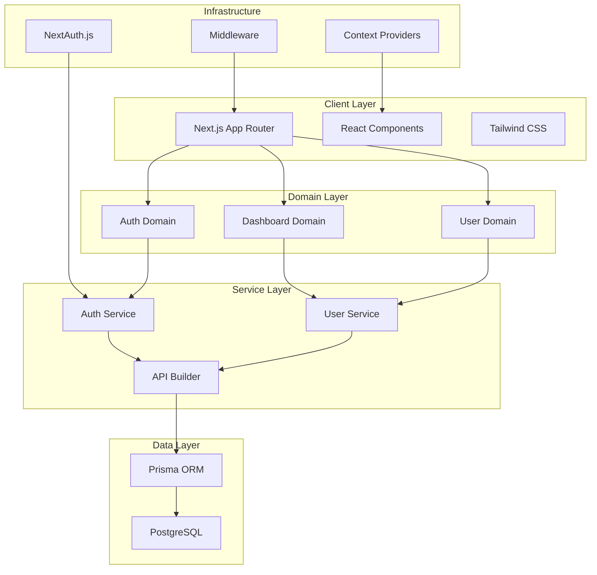
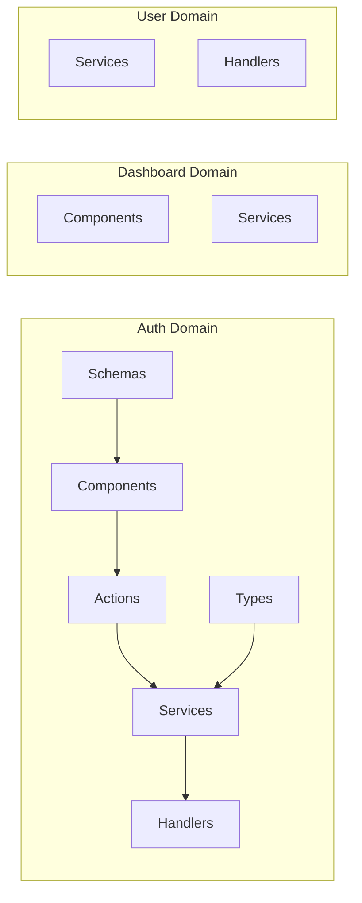
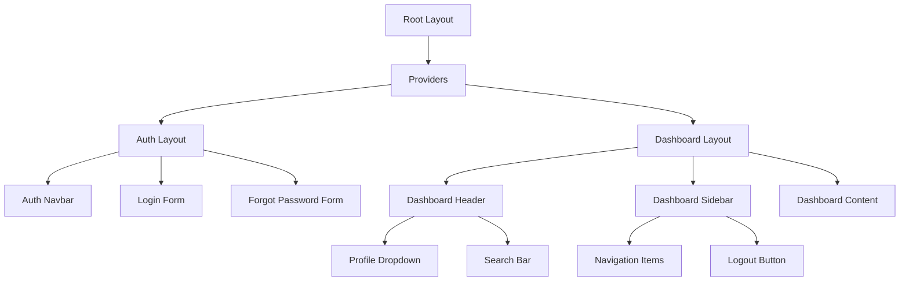
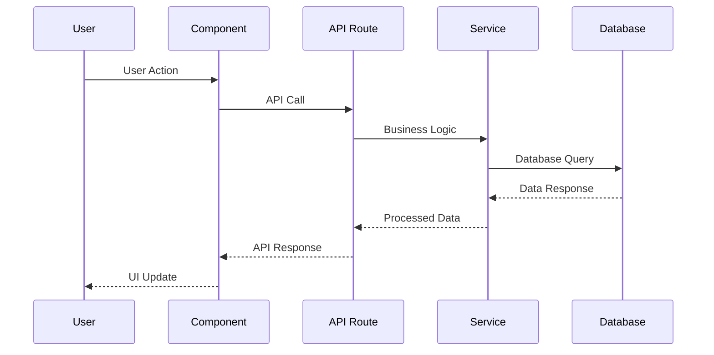
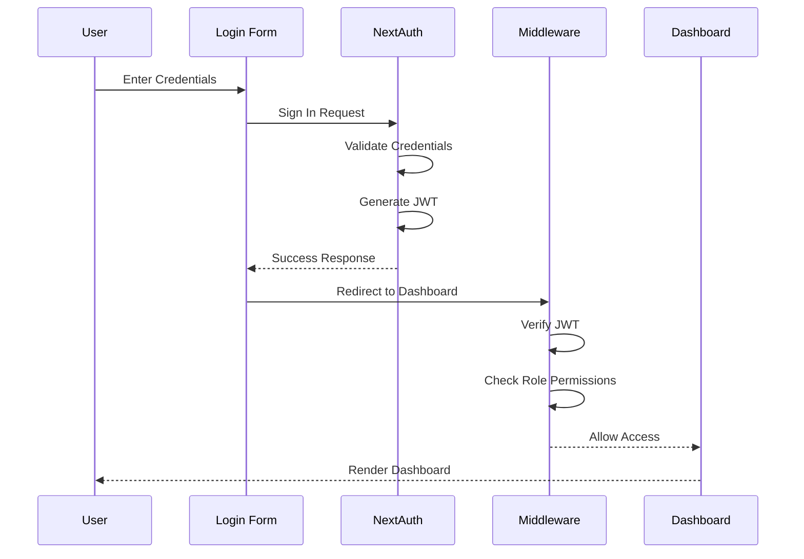
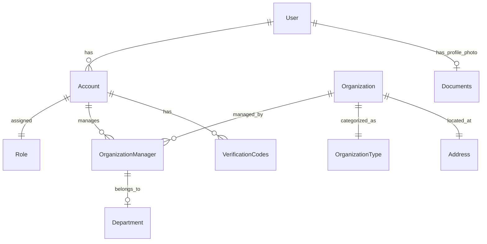
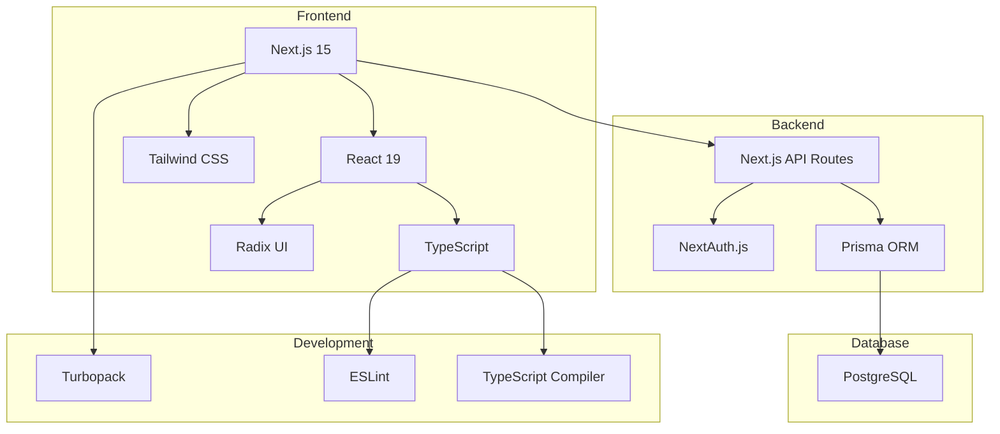

# Thrive Admin Web - Architecture Diagram

## High-Level Architecture



## Domain Structure



## Component Hierarchy



## Data Flow



## Authentication Flow



## Database Schema Relationships



## File Structure Visualization

```
admin-web/
├── 📁 src/
│   ├── 📁 app/                    # Next.js App Router
│   │   ├── 📁 (auth)/            # Auth route group
│   │   ├── 📁 (private)/         # Protected route group
│   │   ├── 📁 api/               # API routes
│   │   ├── 📄 layout.tsx         # Root layout
│   │   └── 📄 page.tsx           # Home page
│   ├── 📁 domains/               # Domain-Driven Design
│   │   ├── 📁 auth/              # Authentication domain
│   │   ├── 📁 dashboard/         # Dashboard domain
│   │   └── 📁 user/              # User domain
│   ├── 📁 components/            # Shared UI components
│   │   ├── 📁 ui/                # Reusable UI library
│   │   └── 📄 *.tsx              # Custom components
│   ├── 📁 layouts/               # Layout components
│   │   ├── 📁 auth/              # Auth layouts
│   │   └── 📁 dashboard/         # Dashboard layouts
│   ├── 📁 lib/                   # Core utilities
│   ├── 📁 providers/             # React Context providers
│   ├── 📁 styles/                # Styling and fonts
│   ├── 📁 utils/                 # Utility functions
│   ├── 📁 types/                 # TypeScript definitions
│   ├── 📁 constants/             # Application constants
│   └── 📄 middleware.ts          # Route protection
├── 📁 prisma/                    # Database schema
├── 📁 public/                    # Static assets
└── 📄 Configuration files        # Package.json, tsconfig, etc.
```

## Technology Stack Visualization



This architecture diagram provides a visual representation of the Thrive Admin Web application's structure, data flow, and technology relationships.
